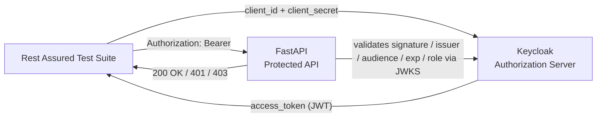

# OAuth 2.0 API Testing Lab

[](https://github.com/pkchat55/oauth-api-testing-lab/actions/workflows/ci.yml)
[](LICENSE)
[](api/requirements.txt)
[](rest-assured/pom.xml)

A hands-on, fully automated lab for **OAuth 2.0 Client Credentials**, JWT
validation, and API security testing — built with **Keycloak**, **FastAPI**,
and **Rest Assured**. Everything in this repo, including the Keycloak realm
and clients, is bootstrapped from code so the whole environment is
reproducible with one command and verified automatically in CI.

## Why this project

Most OAuth tutorials stop at "get a token, call an API." This lab goes further
and demonstrates production-relevant concerns end to end:

- Real JWT signature verification against a JWKS endpoint (not just "is there a Bearer header")
- Issuer, audience, and expiry validation
- Role-based authorization (401 vs 403, not just "valid vs invalid")
- Negative-path testing: wrong secret, unknown client, unsupported grant type
- Infrastructure bootstrapped by script, not manual UI clicking, so it runs the same locally and in CI

## Architecture



## Repository layout

```text
.
├── api/                          # FastAPI resource server
│   ├── app.py                    # JWT validation + role-based authorization
│   └── requirements.txt
├── rest-assured/                 # Java test client
│   ├── pom.xml
│   └── src/test/java/OAuthApiTest.java
├── scripts/
│   └── bootstrap_keycloak.sh     # Idempotent realm/client/role setup (local + CI)
├── docs/
│   ├── LAB_GUIDE.md               # Full step-by-step walkthrough
│   └── reports/                   # Generated HTML/PDF execution reports
└── .github/workflows/ci.yml       # End-to-end CI: Keycloak + API + Rest Assured
```

## Quick start

**Prerequisites:** Docker, Python 3.11+, Java 17+, Maven.

```bash
# 1. Start Keycloak
docker run -d --name keycloak -p 8080:8080 \
  -e KC_BOOTSTRAP_ADMIN_USERNAME=admin \
  -e KC_BOOTSTRAP_ADMIN_PASSWORD=admin \
  quay.io/keycloak/keycloak:26.7.3 start-dev

# 2. Bootstrap the realm, clients, and role (idempotent)
eval "$(./scripts/bootstrap_keycloak.sh)"

# 3. Start the protected API
cd api && python3 -m pip install -r requirements.txt
uvicorn app:app --reload --port 8000 &
cd ..

# 4. Run the full test suite
cd rest-assured && mvn test
```

## What gets tested

| # | Scenario | Expected |
|---|---|---|
| 1 | No Authorization header | `401` |
| 2 | Malformed / unsigned token | `401` |
| 3 | Valid token with required role | `200` |
| 4 | Valid token, missing required role | `403` |
| 5 | Expired token | `401` |
| 6 | Wrong client secret | `401` |
| 7 | Unknown client ID | `401` |
| 8 | Unsupported grant type | `400` |

All 8 scenarios are automated in [`OAuthApiTest.java`](rest-assured/src/test/java/OAuthApiTest.java) and run on every push via [GitHub Actions](.github/workflows/ci.yml).

## Security notes

- No secrets are committed to this repo. `CLIENT_SECRET`/`CLIENT_SECRET_NOROLE` are generated by Keycloak at bootstrap time and only ever live as environment variables.
- The API validates JWTs cryptographically against Keycloak's JWKS endpoint — it does not trust the token's claims without verifying the signature, issuer, audience, and expiry.
- This is a **local development/testing lab** (`start-dev` mode). See [`docs/LAB_GUIDE.md`](docs/LAB_GUIDE.md#16-production-considerations) for what changes in production.

## Documentation

- [Full step-by-step lab guide](docs/LAB_GUIDE.md)
- [Execution report (HTML)](docs/reports/oauth-lab-report.html)
- [Execution report (PDF)](docs/reports/OAuth_API_Testing_Lab_Report.pdf)

## Contributing

Contributions are welcome — see [CONTRIBUTING.md](CONTRIBUTING.md).

## License

[MIT](LICENSE)
